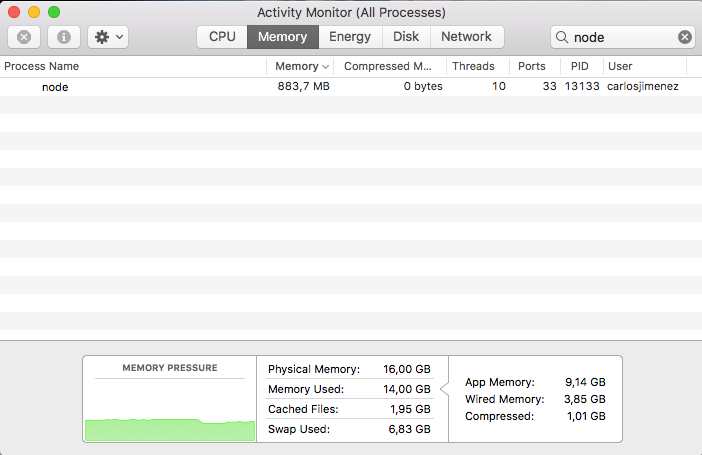
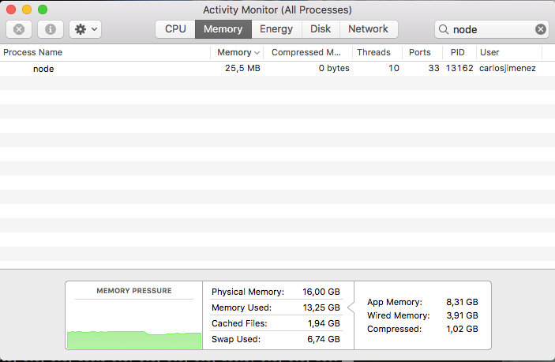

# Node.js Streams
Basically, a stream is an EventEmmiter. It implements some special methods. Depending on these methods, a stream becomes:
- Readable
- Writable
- Duplex (both readable and writable)

Readable streams let you read data from a source. Writable streams let you write data to a destination.

Streams are collections of data (just as arrays or strings).
The difference is that streams data might not be available all at once and it does not have to fit in memory. 
This properties make streams to be a really powerful tool ehen working with large amounts of data, or data coming from external sources.

Moreover, streams also bring the power of composability, as they can be piped one thorugh another, just like Unix commands.


## Readable streams
A readable stream lets you read data from a source.
The source can be anything. It can be a simple file on your file system, a buffer in memory or even another stream. As streams are EventEmitters, they emit several events at various points. We will use these events to work with the streams.

There are several examples of readable stream implementations in the Node.js and outside of it.

Here are some of them:

- The contents of a file
- An server HTTP request body
- A server TCP connection
- A client HTTP response body
- A client TCP connection
- The changes on a database
- A video stream
- An audio stream
- The results of a database query
- and many more...

The best way to read data from a stream is to listen to data event and attach a callback. When a chunk of data is available, the readable stream emits a data event and your callback executes.

- 01_readableStreams.js
``` 
const fs = require('fs');
const readableStream = fs.createReadStream('input/00file.txt');
let data = '';

readableStream.on('data', function(chunk) {
    data += chunk;
});

readableStream.on('end', function() {
    console.log(data);
});
```

There is also another way to read from stream. You just need to call read() on the stream instance repeatedly until every chunk of data has been read.

- 02_readableStreams_read.js
```
const fs = require('fs');
const readableStream = fs.createReadStream('input/00file.txt');
let data = '';
let chunk;

readableStream.on('readable', function() {
    while ((chunk = readableStream.read()) != null) {
        data += chunk;
    }
});

readableStream.on('end', function() {
    console.log(data)
});
```

## Custom readable
There is a simple way to implement readable streams. We can just directly push the data that we want the consumers to consume.
- 07_Readable.js
```
const { Readable } = require('stream');

const inStream = new Readable();

inStream.push('ABCDEFGHIJKLM');
inStream.push('NOPQRSTUVWXYZ');

inStream.push(null); // No more data

inStream.pipe(process.stdout);
```

When we push a null object, that means we want to signal that the stream does not have any more data.
To consume this simple readable stream, we can simply pipe it into the writable stream process.stdout.


We’re basically pushing all the data in the stream before piping it to process.stdout. The much better way is to push data on demand, when a consumer asks for it. We can do that by implementing the read() method in a readable stream configuration:
When the read method is called on a readable stream, the implementation can push partial data to the queue. For example, we can push one letter at a time, starting with character code 65 (which represents A), and incrementing that on every push:

- 08_readable.js
```
const { Readable } = require('stream');

const inStream = new Readable({
  read(size) {
    this.push(String.fromCharCode(this.currentCharCode++));
    if (this.currentCharCode > 90) {
      this.push(null);
    }
  }
});
inStream.currentCharCode = 65; // A
inStream.pipe(process.stdout);
```

## Writable Streams
To write data to a writable stream you need to call write() on the stream instance. 

- 03_writableStreams.js

```
const fs = require('fs');
const readableStream = fs.createReadStream('input/00file.txt');
const writableStream = fs.createWriteStream('output/03.txt');

readableStream.setEncoding('utf8');

readableStream.on('data', function(chunk) {
    writableStream.write(chunk);
});
```

Some examples of writable streams in Node are:

- a writable file in append mode
- a TCP connection
- the process standard output stream
- a server HTTP response body
- a database bucket (or table)
- an HTML parser
- a remote logger
- ... and many more

Here are some important events related to writable streams:

- Readable.pause() – This method pauses the stream. If the stream is already flowing, it won’t emit data events anymore. The data will be kept in buffer. If you call this on a static (non-flowing) stream, the stream starts flowing, but data events won’t be emitted.
- Readable.resume() – Resumes a paused stream.
- readable.unpipe() – This removes destination streams from pipe destinations. If an argument is passed, it stops the readable stream from piping into the particular destination stream. Otherwise, all the destination streams are removed.

## Piping
Piping is a great mechanism in which you can read data from the source and write to destination without managing the flow yourself.

- 04_piping.js
```
const fs = require('fs');
const readableStream = fs.createReadStream('input/00file.txt');
const writableStream = fs.createWriteStream('output/04.txt');

readableStream.pipe(writableStream);
```

## Chaining
Assume that you have an archive and want to decompress it. There are a number of ways to achieve this. But the easiest and cleanest way is to use piping and chaining.

- 05_chaining.js

```
const fs = require('fs');
const zlib = require('zlib');

fs.createReadStream('input/05.txt.gz')
  .pipe(zlib.createGunzip())
  .pipe(fs.createWriteStream('output/05.txt'));
```

## Duplex Streams
With Duplex streams, we can implement both readable and writable streams with the same object. It’s as if we inherit from both interfaces.

- 09_duplex.js
```
const { Duplex } = require('stream');

const inoutStream = new Duplex({
  write(chunk, encoding, callback) {
    console.log(chunk.toString());
    callback();
  },

  read(size) {
    this.push(String.fromCharCode(this.currentCharCode++));
    if (this.currentCharCode > 90) {
      this.push(null);
    }
  }
});

inoutStream.currentCharCode = 65;
process.stdin.pipe(inoutStream).pipe(process.stdout);
```


## Transformation
A transform stream is the more interesting duplex stream because its output is computed from its input.

For a transform stream, we don’t have to implement the read or write methods, we only need to implement a transform method, which combines both of them. It has the signature of the write method and we can use it to push data as well.

With the data exposed once a stream is opened, this data that comes from the stream can be transformed before it reaches its destination.

An example is transforming all lowercase characters in a file to uppercase characters.

- 10_transform.js
```
const { Transform } = require('stream');

const upperCaseTr = new Transform({
  transform(chunk, encoding, callback) {
    this.push(chunk.toString().toUpperCase());
    callback();
  }
});

process.stdin.pipe(upperCaseTr).pipe(process.stdout);
```

This is one of the greatest powers of streams. Once a stream is opened and you can read the data piece by piece, you can slot different programs in between. The figure below illustrates this process.


- 11_transform.js
```
const fs = require('fs');
const readableStream = fs.createReadStream('input/00file.txt');
const writableStream = fs.createWriteStream('output/11.txt');
const { Transform } = require('stream');

const toUpperStream = new Transform({
	transform(chunk, encoding, cb) {
		this.push(chunk.toString().toUpperCase());
		cb();
	}
});

readableStream.setEncoding('utf8');

readableStream.pipe(toUpperStream).pipe(writableStream);
```


## Object Mode
By default, streams expect Buffer/String values. There is an objectMode flag that we can set to have the stream accept any JavaScript object.


## Node’s built-in transform streams
Node has a few very useful built-in transform streams. Namely, the zlib and crypto streams.

- 14_nodeBuiltInLibs.js
```
const fs = require('fs');
const zlib = require('zlib');
const file = process.argv[2];

fs.createReadStream(file)
  .pipe(zlib.createGzip())
  .pipe(fs.createWriteStream(file + '.gz'));
```

- 15_progressBar.js
``` 

const fs = require('fs');
const zlib = require('zlib');
const file = process.argv[2];

fs.createReadStream(file)
  .pipe(zlib.createGzip())
  .on('data', () => process.stdout.write('.'))
  .pipe(fs.createWriteStream(file + '.zz'))
  .on('finish', () => console.log('Done'));
``` 


## Why use streams? 

An example of why streams must be used is about memory comsuption.

Let's create a big file:
- 90_bigFile_create.js
```
const fs = require('fs');
const file = fs.createWriteStream('./output/big.file');

for(let i=0; i<= 1e6; i++) {
  file.write('Con el arte que te sobra, con la gente que quiere en el tiempo y la memoria manque pierda blanco y verde. Corazón que late fuerte, sentimiento que desborda, tradición que desde siempre es motivo de tu gloria. Ole, ole, ole ole, Betis olé. Ole, ole, ole, ole, Betis olé. Ole, ole, ole, Betis. Ole, ole, Betis. Ole, ole, ole, ole, Betis olé. Tu corazón ya tiene un siglo, siente el calor de la afición que está contigo. Ole, ole, ole ole, Betis olé. Ole, ole, ole, ole, Betis olé. Ole, ole, ole, Betis. Ole, ole, Betis. Ole, ole, ole, ole, Betis olé. Mucho más que un sentimiento, mucho más que una bandera, muchás que todo eso, más allá de la frontera, siempre habrá alguien que diga ¡Viva el Betis manque pierda! Y así sonarán los sones Al Final de la Palmera. Ole, ole, ole ole, Betis olé. Ole, ole, ole, ole, Betis olé. Ole, ole, ole, Betis. Ole, ole, Betis. Ole, ole, ole, ole, Betis olé. \n');
}

file.end();
```

The size of this file is nearly 1GB.

Let's serve this file in a simple express server and see the memory of the node process.

- 91_bigFile_server.js
```
const fs = require('fs');
const server = require('http').createServer();

server.on('request', (req, res) => {
  fs.readFile('./output/big.file', (err, data) => {
    if (err) throw err;
  
    res.end(data);
  });
});

server.listen(8000);
```



- 92_bigFile_stream.js
```
const fs = require('fs');
const server = require('http').createServer();

server.on('request', (req, res) => {
  const src = fs.createReadStream('./output/big.file');
  src.pipe(res);
});

server.listen(8000);
```




In the first chunk of code, the process has to store in memory the whole file in order to serve it. In the second, this does not happen this way, as the stream make the memory to be filled by small chunks of data instead the whole file. So, using streams we can move and transform large amount of data without impacting the memory.

## Referral links
- [NodeJS official Streams API](https://nodejs.org/api/stream.html)
- https://www.sitepoint.com/basics-node-js-streams/
- https://www.desarrolloweb.com/articulos/streams-nodejs.html
- https://community.risingstack.com/the-definitive-guide-to-object-streams-in-node-js/
- https://medium.freecodecamp.com/node-js-streams-everything-you-need-to-know-c9141306be93